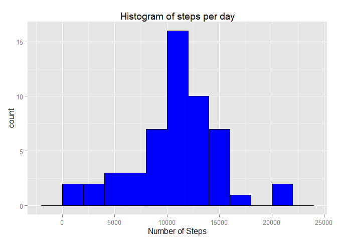
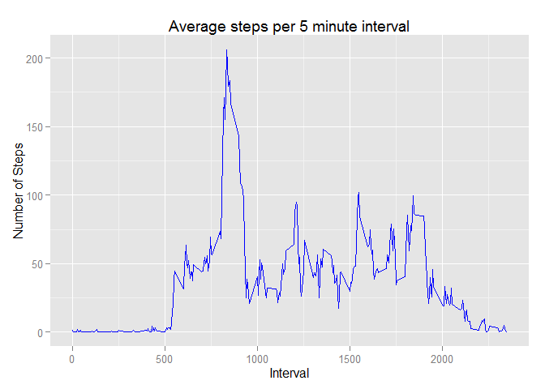
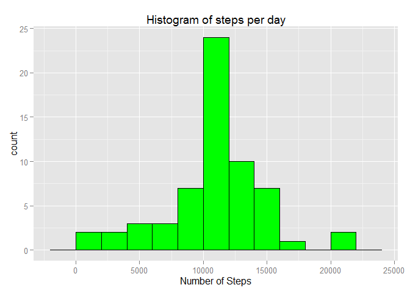
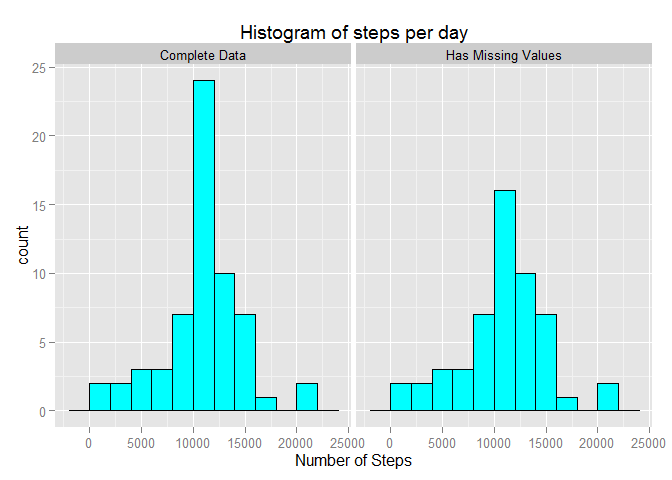
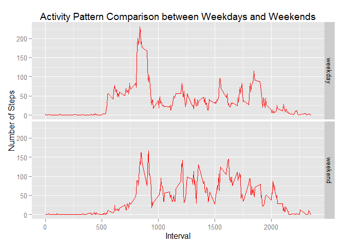

# Reproducible Research: Peer Assessment 1

This assignment aims at creating a R Markdown document which describes an analysis
of data collected from an activity monitoring device. The data consists of two 
months of data from an anonymous individual collected during the months of October 
and November, 2012 and include the number of steps taken in 5 minute intervals each day.  
This assignment is divided into 5 parts. The first part is:

###Loading and preprocessing the data
Here, I will do as was mentioned in the course lectures and will not store any
output data. So, as the original data file was in .zip format, I will keep it 
this way and use R to prepare the data:

```r
# The activity.zip file must be in the current working directory
unzip("activity.zip")
data <- read.csv("activity.csv")
str(data)
```

```
## 'data.frame':	17568 obs. of  3 variables:
##  $ steps   : int  NA NA NA NA NA NA NA NA NA NA ...
##  $ date    : Factor w/ 61 levels "2012-10-01","2012-10-02",..: 1 1 1 1 1 1 1 1 1 1 ...
##  $ interval: int  0 5 10 15 20 25 30 35 40 45 ...
```
As you can see, the date variable comes as a factor, so I will change it to a
Date variable.

```r
data$date <- as.Date(data$date)
str(data)
```

```
## 'data.frame':	17568 obs. of  3 variables:
##  $ steps   : int  NA NA NA NA NA NA NA NA NA NA ...
##  $ date    : Date, format: "2012-10-01" "2012-10-01" ...
##  $ interval: int  0 5 10 15 20 25 30 35 40 45 ...
```
Now, to the next part, in which I must answer the question: 

###What is mean total number of steps taken per day?
For that, since the data comes as number of steps per each 5 minute interval,
I must sum all the steps for each day. I will do this by grouping the data by
date and use sum as the aggregator.

```r
library(dplyr)
```

```
## 
## Attaching package: 'dplyr'
## 
## The following object is masked from 'package:stats':
## 
##     filter
## 
## The following objects are masked from 'package:base':
## 
##     intersect, setdiff, setequal, union
```

```r
data <- tbl_df(data)
stepsPerDay <- data %>% group_by(date) %>% summarise(steps = sum(steps))
stepsPerDay
```

```
## Source: local data frame [61 x 2]
## 
##          date steps
## 1  2012-10-01    NA
## 2  2012-10-02   126
## 3  2012-10-03 11352
## 4  2012-10-04 12116
## 5  2012-10-05 13294
## 6  2012-10-06 15420
## 7  2012-10-07 11015
## 8  2012-10-08    NA
## 9  2012-10-09 12811
## 10 2012-10-10  9900
## ..        ...   ...
```
Now, following the assignment, I will plot a histogram of the total number of steps
taken each day:

```r
library(ggplot2)
qplot(stepsPerDay$steps, geom = "histogram", binwidth = 2000, 
      main = "Histogram of steps per day", xlab = "Number of Steps", 
      col = I("black"), fill = I("blue"))
```

 

To finish this part I will calculate the Mean and the Median of the number of 
steps per day.

```r
mean <- format(mean(stepsPerDay$steps, na.rm = TRUE))
median <- median(stepsPerDay$steps, na.rm = TRUE)
```
The mean is 10766.19 and the median is 10765.

###What is the average daily activity pattern?
To answer this question, I'll plot a time series of the average number of steps
taken in each 5 minute interval across all days.

```r
avgStepsPer5min <- data %>% group_by(interval) %>% 
    summarise(steps = mean(steps, na.rm = TRUE))
qplot(interval, steps, data = avgStepsPer5min, geom = "line", 
      main = "Average steps per 5 minute interval", col = I("blue"), 
      xlab = "Interval", ylab = "Number of Steps")
```

 

Now, to figure out which interval contains the maximum average number of steps:

```r
maxAvgStepsInterval <- avgStepsPer5min$interval[
    avgStepsPer5min$steps == max(avgStepsPer5min$steps)
    ]
```
And the answer is: on average, the **835th** interval is when 
most of the stepping action happens.

###Imputing missing values
The original data has some missing values which could be a hindrance to future
calculations. Let's check the total number of missing values in the data set.

```r
sum(is.na(data$steps))
```

```
## [1] 2304
```
That's quite a large number of missing values. To fill in those blank spaces 
I will use the average steps per interval that has been already calculated.
First, I will subset only the missing rows:

```r
missingRows <- data[is.na(data$steps),]
head(missingRows)
```

```
## Source: local data frame [6 x 3]
## 
##   steps       date interval
## 1    NA 2012-10-01        0
## 2    NA 2012-10-01        5
## 3    NA 2012-10-01       10
## 4    NA 2012-10-01       15
## 5    NA 2012-10-01       20
## 6    NA 2012-10-01       25
```
Now, by merging the missing rows with the average steps per interval using as 
keys the interval variable, I will fill in the blanks

```r
filledRows <- merge(missingRows, avgStepsPer5min, by.x = "interval", by.y = "interval")
head(filledRows)
```

```
##   interval steps.x       date  steps.y
## 1        0      NA 2012-10-01 1.716981
## 2        0      NA 2012-11-30 1.716981
## 3        0      NA 2012-11-04 1.716981
## 4        0      NA 2012-11-09 1.716981
## 5        0      NA 2012-11-14 1.716981
## 6        0      NA 2012-11-10 1.716981
```
Then, I will merge the filled rows with the original data using as keys the date 
and interval variables

```r
completeData <- merge(data, filledRows, by.x = c("date", "interval"), 
                      by.y = c("date", "interval"), all.x=TRUE)
```
The resulting data ends up with two additional columns: steps.x which is equal to 
steps and steps.y which only has values where steps does not. So I must merge 
these two complementary columns.

```r
completeData$steps[is.na(completeData$steps)] <- completeData$steps.y[is.na(completeData$steps)]
completeData <- select(completeData, date, interval, steps)
head(completeData)
```

```
##         date interval     steps
## 1 2012-10-01        0 1.7169811
## 2 2012-10-01        5 0.3396226
## 3 2012-10-01       10 0.1320755
## 4 2012-10-01       15 0.1509434
## 5 2012-10-01       20 0.0754717
## 6 2012-10-01       25 2.0943396
```
To make sure it worked, let's check for missing values.

```r
any(is.na(completeData$steps))
```

```
## [1] FALSE
```
Let's now analyse the impact of filling in these missing values and recreate the 
histogram from the first part of the assignment.

```r
completeData <- tbl_df(completeData)
completeStepsPerDay <- completeData %>% group_by(date) %>% summarise(steps = sum(steps))
completeStepsPerDay
```

```
## Source: local data frame [61 x 2]
## 
##          date    steps
## 1  2012-10-01 10766.19
## 2  2012-10-02   126.00
## 3  2012-10-03 11352.00
## 4  2012-10-04 12116.00
## 5  2012-10-05 13294.00
## 6  2012-10-06 15420.00
## 7  2012-10-07 11015.00
## 8  2012-10-08 10766.19
## 9  2012-10-09 12811.00
## 10 2012-10-10  9900.00
## ..        ...      ...
```

```r
qplot(completeStepsPerDay$steps, geom = "histogram", binwidth = 2000, 
      main = "Histogram of steps per day", xlab = "Number of Steps", 
      col = I("black"), fill = I("green"))
```

 

Well, it's hard to compare when the plots are so far apart. So let's plot them 
together. First, I will add another column to distinguish the data.

```r
stepsPerDay$type = "Has Missing Values"
completeStepsPerDay$type = "Complete Data"
```
Now, I must unite the data and finally plot it.

```r
allStepsPerDay <- rbind(stepsPerDay, completeStepsPerDay)
qplot(steps, data = allStepsPerDay, geom = "histogram", binwidth = 2000,
      main = "Histogram of steps per day", xlab = "Number of Steps",
      col = I("black"), fill = I("cyan"), facets = . ~ type)
```

 

Recalculating the mean and median and the standard deviations, we get:

```r
mean2 <- format(mean(completeStepsPerDay$steps))
median2 <- format(median(completeStepsPerDay$steps))
stddev <- format(sd(stepsPerDay$steps, na.rm = TRUE))
stddev2 <- format(sd(completeStepsPerDay$steps))
```
The previous mean is **10766.19** and the previous median is **10765**.
The new mean is **10766.19** and the new median is **10766.19**.
The standard deviation for the data set with missing values is **4269.18**. 
The standard deviation for the complete data set is **3974.391**. 
It becomes evident that filling in the missing values had no impact on the 
estimates of the total daily number of steps. The plots reinforce this fact since 
everything looks the same between them except for the highest frequency bar, which 
contains the mean value. What does change is the standard deviation which 
decreases. That should be expected since only mean values were added to the data.

Now, to the last questions, which is:

###Are there differences in activity patterns between weekdays and weekends?
To answer it, let's first differentiate between weekdays and weekends.

```r
completeData$weekday <- weekdays(completeData$date)
# I'm in Brazil, so my R sets weekdays in Portuguese 
# (sábado = saturday and domingo = sunday)
completeData$isWeekend <- ifelse(completeData$weekday %in% c("sábado", "domingo"), 
                                 "weekend", "weekday")
completeData$isWeekend <- as.factor(completeData$isWeekend)
head(completeData)
```

```
## Source: local data frame [6 x 5]
## 
##         date interval     steps       weekday isWeekend
## 1 2012-10-01        0 1.7169811 segunda-feira   weekday
## 2 2012-10-01        5 0.3396226 segunda-feira   weekday
## 3 2012-10-01       10 0.1320755 segunda-feira   weekday
## 4 2012-10-01       15 0.1509434 segunda-feira   weekday
## 5 2012-10-01       20 0.0754717 segunda-feira   weekday
## 6 2012-10-01       25 2.0943396 segunda-feira   weekday
```
And now let's make a time series plot comparing between Weekdays and Weekends. 
First I need to group the data by the isWeekend and interval variables.

```r
completeData <- tbl_df(completeData)
stepsByIsWeekendInterval <- 
    completeData %>% 
    group_by(isWeekend, interval) %>%
    summarise(steps = mean(steps))
head(stepsByIsWeekendInterval)
```

```
## Source: local data frame [6 x 3]
## Groups: isWeekend
## 
##   isWeekend interval      steps
## 1   weekday        0 2.25115304
## 2   weekday        5 0.44528302
## 3   weekday       10 0.17316562
## 4   weekday       15 0.19790356
## 5   weekday       20 0.09895178
## 6   weekday       25 1.59035639
```
Now, to the plot:

```r
qplot(interval, steps, data = stepsByIsWeekendInterval, geom = "line",
      facets = isWeekend ~ ., xlab = "Interval", ylab = "Number of Steps",  
      main = "Activity Pattern Comparison between Weekdays and Weekends", 
      col = I("red"))
```

 

Analyzing the plot we can get some conclusions:  
    * In Weekdays the walking starts earlier and more suddenly then on Weekends.  
    * In Weekdays most of the walking is concentrated around lunch hours.  
    * In Weekends the walking is more evenly distributed throughout the day.  
(I really tried, but couldn't make the unordered list to work)

So, here I wrap up this assignment. I hope have enjoyed reading it as much as 
I have enjoyed making it. :)
